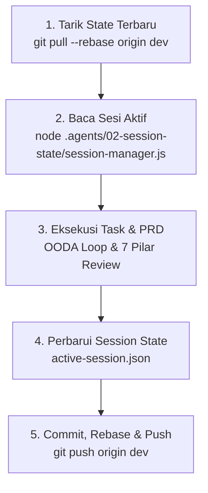

# SOP Kolaborasi Tim & Alur Percabangan Git (Multi-Device Collaboration)

> **Kapan Digunakan:** Wajib dipatuhi pada setiap siklus pengerjaan fitur, prompt perubahan baru, perbaikan bug, dan sebelum melakukan `git push` ke repositori remote.

---

## 1. Aturan Percabangan (Branching Strategy)

* **Branch `main` (Production):**
  * Bertindak sebagai *Release/Production* yang stabil.
  * Hanya menerima merge dari `dev` setelah pengujian fitur tuntas dan terverifikasi oleh QA Delivery Gate.
  * Dilarang melakukan *direct commit* atau *force push* ke `main`.
* **Branch `dev` (Development):**
  * **Branch aktif utama untuk seluruh tim pengembangan dan agen AI.**
  * Setiap pengerjaan tugas, prompt perubahan, penambahan fitur, dan perbaikan harian WAJIB berada di branch `dev`.
  * Setiap *commit* dan *push* perubahan langsung diarahkan ke `dev`.

---

## 2. Siklus Baku 5-Langkah Kolaborasi Multi-Perangkat & Multi-Agen

Karena proyek ini dikerjakan oleh tim multi-developer dan multi-agen di perangkat berbeda, seluruh siklus pengerjaan prompt perubahan wajib menjalankan SOP 5 langkah berikut:



### Langkah 1: Tarik Pembaruan Terbaru (*Pre-Dev Pull*)
Sebelum memulai prompt atau tugas baru, selalu jalankan:
```bash
git checkout dev
git pull --rebase origin dev
```

### Langkah 2: Inspeksi State Sesi Aktif (*Read Session State*)
Periksa status milestone dan batasan arsitektur terkunci:
```bash
node .agents/02-session-state/session-manager.js
```
Baca file `.agents/02-session-state/active-session.json` untuk mengetahui `active_goal`, `completed_milestones`, dan batasan yang sudah disepakati (`established_constraints`).

### Langkah 3: Eksekusi Tugas Sesuai Bab PRD
Terapkan perubahan kode sesuai spesifikasi di `PRD.md` dan standar rekayasa di `.agents/rules/`. Terapkan pemisahan peran Builder vs Reviewer tanpa *self-review*.

### Langkah 4: Mutakhirkan `active-session.json` (*Update State*)
Setelah kode diverifikasi lolos:
1. Perbarui timestamp `last_updated`.
2. Pindahkan milestone yang telah selesai ke `completed_milestones` dengan status `VERIFIED_PASS`.
3. Perbarui status bab pada `prd_coverage_tracker`.
4. Perbarui `next_actionable_steps`.

### Langkah 5: Tarik Ulang Sebelum Push & Kirim ke GitHub (*Sync Push Mandate*)
Tepat sebelum push, lakukan rebase untuk mengantisipasi commit tim lain yang masuk selama development:
```bash
git add .
git commit -m "feat(modul): deskripsi perubahan dan pembaruan session state"
git pull --rebase origin dev
git push origin dev
```

---

## 3. Larangan Keras Git

1. **DILARANG** melakukan `git push --force` ke branch `dev` maupun `main`.
2. **DILARANG** melakukan commit langsung ke `main` untuk pekerjaan development harian.
3. **DILARANG** melakukan *stash pop* atau *hard reset* tanpa memeriksa perbedaan kode (*diff*) terlebih dahulu.
4. **DILARANG** menyertakan file kredensial rahasia (`.env.local`, `DOC_SERVICES.md`) ke dalam git commit.
