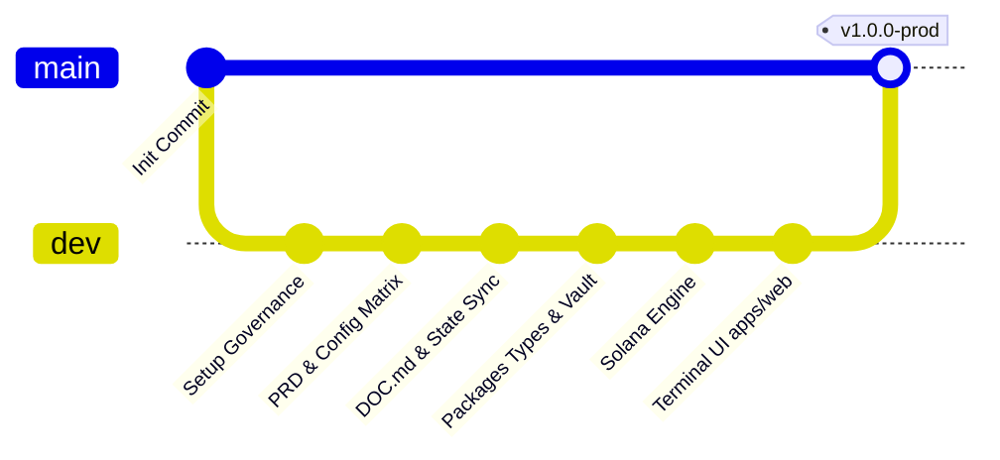
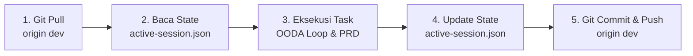

# DOC.md: Panduan Kolaborasi Tim & Pengembangan SolanaTradeMemes

> **Official Team Engineering & Collaboration Guide**  
> **Dasar Rujukan Mutlak**: [`PRD.md`](./PRD.md) & [`AGENTS.md`](./AGENTS.md)  
> **Status**: Berlaku Mengikat (*Strict Mandatory*) untuk Seluruh Pengembang & Agen AI

---

## 1. Visi Produk & Topologi Monorepo

**SolanaTradeMemes** adalah *Pure Client-Side Multi-Wallet Trading Terminal* untuk memecoin Solana yang mengutamakan kecepatan eksekusi sub-detik, penandatanganan transaksi v0 lokal di memori peramban, serta isolasi keamanan kunci privat total tanpa membebani server backend atau Vercel (*Zero Backend Execution*).

Struktur repositori menggunakan arsitektur **Turborepo & pnpm workspaces**:

```
SolanaTradeMemes/
├── apps/
│   ├── web/                     # Frontend Next.js 15 Client SPA / PWA Terminal (Vercel)
│   └── (future: desktop/cli)/   # Ekstensibilitas: Desktop (Tauri) atau CLI Sniper
├── packages/
│   ├── solana-engine/           # PumpPortal API, v0 Versioned Tx Signer, Broadcast
│   ├── crypto-vault/            # Web Crypto API (PBKDF2 + AES-GCM), IndexedDB (idb), Memory Zeroing
│   ├── types/                   # Zod Validation Schemas, TypeScript DTOs, Constants
│   └── ui/                      # Shared Design System: Radix UI, Tailwind CSS Cyberpunk Dark
├── .agents/                     # Tata Kelola Multi-Agen, Rules, Workflows, & Session State
│   ├── 01-roles/                # 22 Spesialis & 14 Expert Personas DNA
│   ├── 02-session-state/        # active-session.json & session-manager.js
│   ├── 04-case-bank/            # Basis Pengetahuan Kasus Produksi Terverifikasi
│   ├── knowledge/               # Peta PRD & Dokumentasi Sinkronisasi
│   ├── rules/                   # Standar Rekayasa (00-core s.d 50-testing)
│   ├── skills/                  # On-Demand Skills Khusus (solana-terminal-engine, crypto-vault-security)
│   └── workflows/               # SOP Eksekusi Fitur, Audit Kripto, & QA Delivery Gate
├── AGENTS.md                    # Universal Multi-Agent Governance Entry File
├── PRD.md                       # Spesifikasi Kebutuhan Produk v1.1 Monorepo (15 Bab)
├── DOC.md                       # Panduan Pengembangan & Kolaborasi Tim (Berkas Ini)
├── README.md                    # Dokumentasi Ringkas Repositori
├── CONFIG_GUIDE.md              # Panduan Langkah Demi Langkah Mendapatkan API Key & RPC
├── .env.example                 # Template Variabel Lingkungan Publik
└── .env.local                   # Kredensial Riil Lokal (Masuk .gitignore)
```

### Larangan Keras Halusinasi Direktori (*Monorepo Path Guard*):
- Dilarang membuat folder baru di root (seperti `src/`, `backend/`, atau `frontend/`).
- Kode aplikasi UI peramban **WAJIB** berada di `apps/web/src/`.
- Kode transaksi Solana & PumpPortal **WAJIB** berada di `packages/solana-engine/src/`.
- Kode enkripsi Web Crypto & IndexedDB **WAJIB** berada di `packages/crypto-vault/src/`.
- Kode kontrak tipe & Zod **WAJIB** berada di `packages/types/src/`.
- Kode komponen UI desain sistem **WAJIB** berada di `packages/ui/src/`.

---

## 2. Git Branching Strategy & Kebijakan Kolaborasi Tim

Untuk mencegah konflik kode dan menjaga stabilitas lingkungan produksi, tim menerapkan pemisahan dua cabang utama:



1. **Branch `dev` (Active Development - DEFAULT)**:
   - Seluruh pekerjaan penambahan fitur, perbaikan bug, penyesuaian desain, dan eksperimen harian **WAJIB** dilakukan di branch `dev`.
   - Seluruh pengembang dan agen AI wajib berada di branch ini selama fase pengembangan aktif.
2. **Branch `main` (Production Release - PROTECTED)**:
   - Branch `main` diproteksi ketat dan hanya menerima penggabungan (*merge*) dari `dev` saat seluruh fitur sprint telah stabil, teruji, dan lulus verifikasi QA Delivery Gate.
   - Dilarang melakukan *direct commit* atau *force push* ke branch `main`.

---

## 3. Protokol Sinkronisasi Session State Multi-Agen (`active-session.json`)

Agar seluruh anggota tim dan agen AI pada perangkat/sesi yang berbeda dapat membaca konteks pengerjaan sebelumnya tanpa mengalami amnesia (*context drift*), tim menerapkan **SOP Wajib 5 Langkah pada Setiap Siklus Perubahan Prompt/Fitur**:



### Rincian SOP 5 Langkah:

1. **Langkah 1: Tarik Pembaruan Terbaru (*Sync Pull*)**:
   Sebelum memulai prompt atau tugas baru, selalu jalankan:
   ```bash
   git pull --rebase origin dev
   ```
2. **Langkah 2: Inspeksi Sesi Aktif (*Read State*)**:
   Periksa status milestone dan batasan yang sedang berjalan menggunakan CLI:
   ```bash
   node .agents/02-session-state/session-manager.js
   ```
   Agen akan membaca file `.agents/02-session-state/active-session.json` untuk mengetahui sub-tugas yang sedang aktif, milestone yang sudah selesai, serta batasan yang terkunci.
3. **Langkah 3: Eksekusi Tugas Sesuai Bab PRD**:
   Kembangkan kode dengan mematuhi bab terkait pada [`PRD.md`](./PRD.md) dan aturan pada `.agents/rules/`.
4. **Langkah 4: Mutakhirkan `active-session.json`**:
   Setelah fitur atau sub-tugas selesai diverifikasi:
   - Perbarui field `last_updated`.
   - Pindahkan milestone yang telah selesai ke dalam array `completed_milestones` dengan status `VERIFIED_PASS`.
   - Perbarui status bab pada `prd_coverage_tracker` (misal dari `IN_PROGRESS` menjadi `MAPPED` atau `COMPLETED`).
5. **Langkah 5: Tarik Ulang Sebelum Push & Kirim ke GitHub (*Sync Push Mandate*)**:
   Tepat sebelum melakukan `git push`, jalankan kembali `git pull --rebase origin dev` untuk memastikan tidak ada perubahan tim lain yang masuk selama development, lalu lakukan push:
   ```bash
   git add .
   git commit -m "feat(modul): deskripsi perubahan fitur dan update session state"
   git pull --rebase origin dev
   git push origin dev
   ```
   Dengan demikian, rekan tim atau agen di perangkat lain yang menjalankan `git pull` akan langsung mengetahui status terkini proyek tanpa risiko konflik (*zero merge conflict*).

---

## 4. Enam Aturan Bisnis & Arsitektur Mutlak (*The 6 Golden Rules of SolanaTradeMemes*)

Seluruh pengembang dan agen AI wajib mematuhi 6 aturan baku ini tanpa kompromi:

1. **Prinsip Zero-Backend Signing & Pure Client-Side Execution (Bab 1 PRD)**:
   - Dilarang membuat Server Actions atau API routes di Vercel yang menerima private key untuk menandatangani transaksi.
   - Seluruh deserialisasi transaksi dan penandatanganan wajib 100% diproses di RAM peramban pengguna.
2. **Isolasi Mutlak Kunci Privat & Zero Network Egress (Bab 4 PRD)**:
   - Paket `@repo/crypto-vault` dilarang mengimpor library jaringan (`fetch`, `axios`, `WebSocket`).
   - Kunci privat hanya disimpan dalam bentuk terenkripsi AES-GCM-256 di IndexedDB (`idb`). Plaintext key di memori wajib dimusnahkan (*zeroed out*) saat sesi dikunci.
3. **Format Transaksi Modern v0 & Address Lookup Tables (Bab 7.2 PRD)**:
   - Seluruh transaksi perdagangan menggunakan `VersionedTransaction` (v0). Dilarang mengonversi kembali ke format legacy `Transaction` karena akan merusak susunan instruksi PumpPortal.
4. **Penyiaran Paralel Resilien via Private RPC (Bab 7.2 PRD)**:
   - Broadcast transaksi dari banyak dompet wajib menggunakan `Promise.allSettled()` langsung ke Private RPC (Helius/QuickNode) dengan opsi `{ skipPreflight: true, maxRetries: 3 }` untuk menghindari HTTP 429 dan kegagalan beruntun.
5. **Pencatatan Buku Besar Persisten & Realized PnL (Bab 7.4 PRD)**:
   - Setiap order BUY dan SELL wajib dicatat ke IndexedDB `trade_history`.
   - Realized PnL dihitung otomatis saat SELL menggunakan metode *Weighted Average Cost Basis* (WACB) agar trader selalu mengetahui profit riil per transaksi.
6. **Bebas Em Dash (R-02 Anti-Slop)**:
   - Larangan mutlak penggunaan karakter em dash panjang (U+2014). Gunakan tanda minus biasa (`-`) atau titik dua.

---

## 5. Peta Navigasi Cepat 15 Bab PRD ([PRD.md](./PRD.md))

| Bab PRD | Modul & Fitur | Komponen Monorepo | Lokasi Berkas Utama |
| :--- | :--- | :--- | :--- |
| **Bab 1** | Ringkasan Eksekutif & Pure Client-Side Model | Workspace Config | `PRD.md`, `README.md` |
| **Bab 2** | Problem Statement & Risiko Server Kustodian | Overview | `PRD.md` Bab 2 |
| **Bab 3** | Target Personas (Degen / Multi-Wallet Scalper) | UI UX Strategy | `PRD.md` Bab 3 |
| **Bab 4** | Arsitektur Monorepo Turborepo + pnpm Workspaces| Monorepo Core | `pnpm-workspace.yaml`, `turbo.json` |
| **Bab 5** | Review & Evaluasi Mendalam Tech Stack | Tech Stack Spec | `PRD.md` Bab 5 |
| **Bab 6** | Diagram Alur & Interaksi Antar-Paket | Architecture Flow | `PRD.md` Bab 6 |
| **Bab 7.1**| Kubah Kriptografi Lokal (PBKDF2 + AES-GCM) | `@repo/crypto-vault` | `packages/crypto-vault/src` |
| **Bab 7.2**| Mesin Eksekusi Solana (v0 Signer & PumpPortal) | `@repo/solana-engine`| `packages/solana-engine/src` |
| **Bab 7.3**| Pemantauan Harga 5 Detik & Portofolio Aktif | `apps/web` (TanStack) | `apps/web/src/hooks/useTokenPrice` |
| **Bab 7.4**| Buku Besar Riwayat Transaksi & Realized PnL | `apps/web` (IndexedDB)| `apps/web/src/hooks/useTradeLedger` |
| **Bab 7.5**| Likuidasi Darurat Panic Sell All & Presets | `@repo/solana-engine`| `packages/solana-engine/src/emergency` |
| **Bab 8** | Alur Pipeline Data & Eksekusi (8 Tahapan) | Pipeline Contract | `packages/types/src` |
| **Bab 9** | Batasan Ruang Lingkup (In-Scope vs Out-of-Scope)| Release Scope | `PRD.md` Bab 9 |
| **Bab 10** | User Stories & Acceptance Criteria (Epic 1 s.d 5)| Acceptance Criteria | `PRD.md` Bab 10 |
| **Bab 11** | Persyaratan Non-Fungsional (Performa & CSP) | NFR Security | `.agents/rules/` |
| **Bab 12** | Matriks Penanganan Error (429, Slippage, Crash)| Resilience Matrix | `.agents/knowledge/terminal-cases.md` |
| **Bab 13** | Metrik Keberhasilan & Target Peluncuran | Success Metrics | `PRD.md` Bab 13 |
| **Bab 14** | Panduan Eksekusi Setup Monorepo | Quick Start | `PRD.md` Bab 14 |
| **Bab 15** | Matriks Konfigurasi Lingkungan (.env Matrix) | Config Matrix | `.env.example`, `CONFIG_GUIDE.md` |

---

## 6. Ringkasan Status Kredensial Layanan Eksternal

| Layanan | Endpoint / Nilai | Status Verifikasi | Lokasi Konfigurasi |
| :--- | :--- | :--- | :--- |
| **Helius Primary RPC** | `https://mainnet.helius-rpc.com/?api-key=12705906-...` | **100% Active (Slot Verified)** | `.env.local` & `DOC_SERVICES.md` |
| **Helius WebSocket (WSS)** | `wss://mainnet.helius-rpc.com/?api-key=12705906-...` | **100% Active** | `.env.local` & `DOC_SERVICES.md` |
| **QuickNode Backup RPC** | `https://hardworking-thrumming-market...` | **100% Active (Slot Verified)** | `.env.local` & `DOC_SERVICES.md` |
| **PumpPortal DEX Engine** | `https://pumpportal.fun/api/trade-local` | **100% Active (Publik)** | `.env.local` & `.env.example` |
| **DexScreener Price API** | `https://api.dexscreener.com/latest/dex/tokens` | **100% Active (Publik)** | `.env.local` & `.env.example` |
| **Supabase Project URL** | `https://liomchcyycanwdokqvuf.supabase.co` | **100% Active (Health Check OK)**| `.env.local` & `DOC_SERVICES.md` |
| **Supabase Anon Public Key** | `eyJhbGciOiJIUzI1NiIsInR5cCI6IkpXVCJ9...` | **100% Active (Health Check OK)**| `.env.local` & `DOC_SERVICES.md` |
